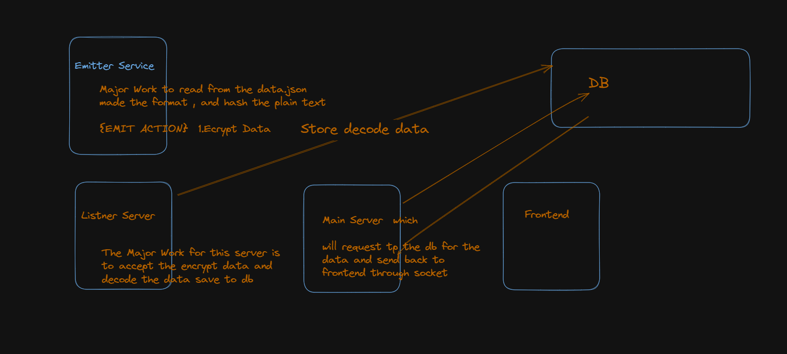
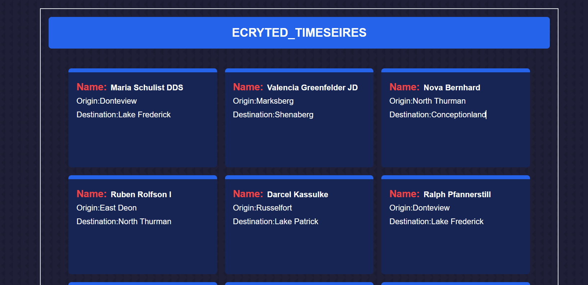
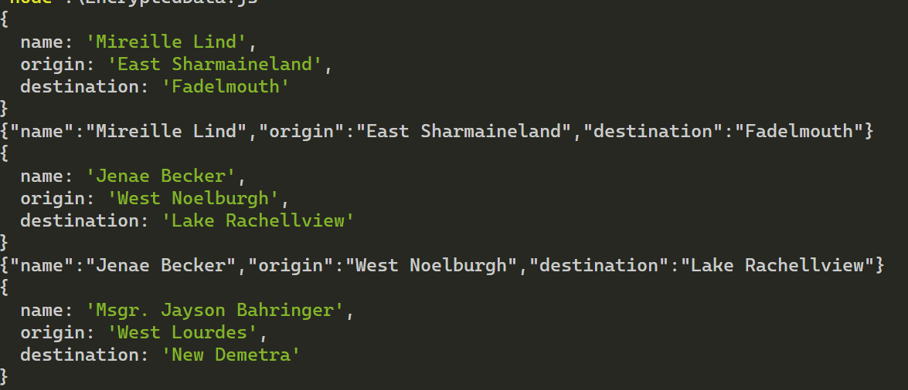
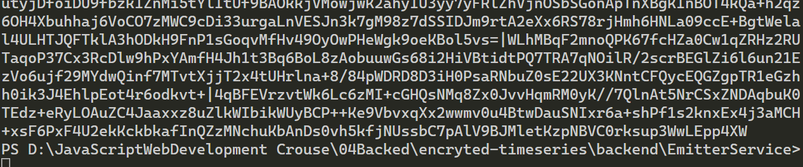
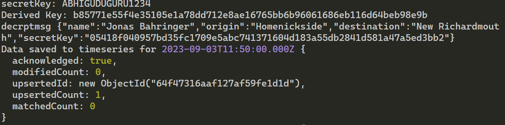
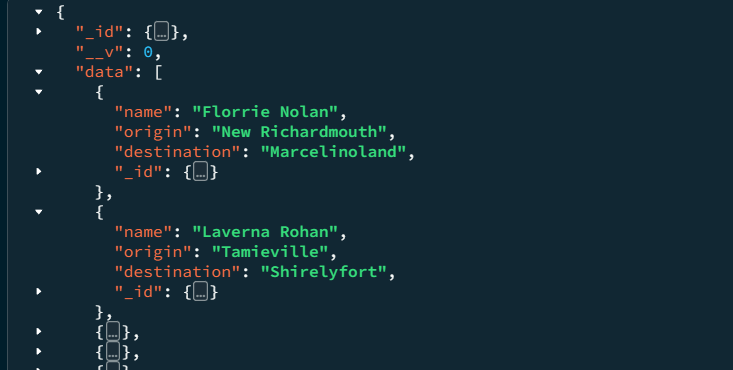

# Encrypted-TIMESERIES

RealTime Data Streaming Using Nodejs(Encrypted-TIMESERIES) **_Mongo DB_**, **_Expresss JS_**, **_React JS_**, **_Node JS_**, **_Tailwind CSS_**,**_crypto_**.

##Problem Statement
Make a small backend application which can generate and emit an encrypted data stream over a socket, listens to incoming data stream on a socket, decrypts and decodes it, save to a time series db and then emit the saved data to a small frontend app. Backend services can be in any language (Node JS is preferred, but use Go or any other that you are comfortable with).

## 👨‍💻 About Developer 👨‍💻

Hey I am Abhishek Bhuyan. Frontend Developer from Odisha . Very much eager to explore and develop scalable, user friendly, robust applications. I also take up couple of bootcamps on web development.

[LinkedIn](https://www.linkedin.com/in/abhisekh-bhuyan-5605b3230/)

Do reach out and provide your valuable insights about the project. I appreciate your inputs.

Do reach out if you have any project idea let's work together and achieve goals.

## 👨‍✈️ Architecture of project (Project Planning) 👨‍✈️

## 🎯 Machine requirements to run this project 🎯

- Node JS (runtime environment)
- Mongo DB Compass

## 🪜 Steps to run the project in your machine 🪜

- Download the project locally
- Unzip the folder
- Open the unzipped folder in vscode
- Click on backend folder
- Rename public.env to .env
- Ppen the .env file
- Provide value to PORT FOR DIFFERENT SERVER variable (My suggestion: 4000,5000,8080)
- Provide value tp MONGODB_URL variable (My suggestion: mongodb://localhost:27017/TimeShareDATA)
- Open new terminal to run server
- Run command 1: cd backend (If your terminal is not in this directory)
- Run command 2: npm install
- Run command 3: npm start
- Now open frontend folder
- If you have entered different value for PORT variable in backend folder > .env file, Update package.json file in frontend folder.
  - Open package.json look for proxy update :4000 value in the proxy value to the value you provided in .env
  - For example:
    - Port=5000 (.env file backend folder)
    - proxy:"https://localhost:5000" (package.json file frontend folder)
    - or you can use cors modules in backend
- Open a new terminal to run frontend
- Run command 1: cd frontend (If your terminal is not in this directory)
- Run command 2: npm install
- Run command 3: npm start

If your webpage doesn't load hit this url in your browser: http://localhost:3000

### 🎉 Here you go your application is up and running... 🎉

## ❤️ Glimpse of project ❤️

### Web View 🖥️

- Time taken: 48 days
-

## 🎯 Challenges i have face 🎯

- During the encrpted the data as i have new in backend i have to understand whole flow of execution of program
- Pending Task While Fetching data from the DB in realTime cant able resolved the timeout fetch 10000ms erorr in mongodb

## 😄 Thanks for spending your valuable time on this project 😄
